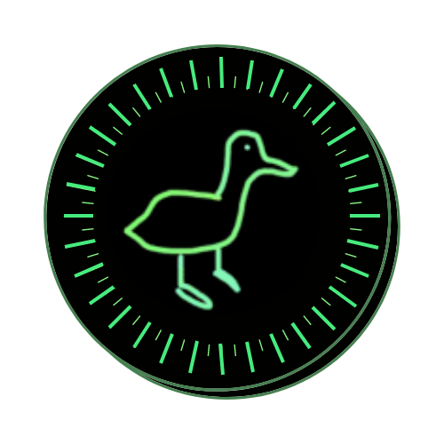

# Quack Slack App & Ethereum Token

## What is Quack?

Quack is a digital currency built on the the Etheruem ERC-20 standard. It will be deployed to an Ethereum testnet and used as a workspace specific currency in Slack.

## What is the purpose of Quack?

Quack Slack App will allow members of the workspace to show appreciation for one another by tipping, use the coins to show support for proposals and hopefully purchase digital artwork created by other members. This will incentivize acts of appreciation, encourage camaraderie and make Slack more fun and interactive.

## Quack Creators

-   Dylan White
    -   [GitHub](https://github.com/glass-waves) | [LinkedIn](https://www.linkedin.com/in/dylan-j-white/) | [Twitter](https://twitter.com/GlassWavs)
-   Julianne Vela
    -   [GitHub](https://www.github.com/julianne-vela) | [LinkedIn](https://www.linkedin.com/in/juliannevela/) | [Porfolio](https://www.juliannevela.dev) (in-progress) | [Twitter](https://www.twitter.com/NessimaSkye)
-   Anthony Rosario
    -   [GitHub](https://github.com/Anthony-Rosario) | [LinkedIn](https://www.linkedin.com/in/anthony-rosario/)
-   Minh Ngo
    -   [GitHub](https://github.com/ngominh0224) | [LinkedIn](https://www.linkedin.com/in/minhnngo/)

## User Stories

-   As a workspace user, I would like to be able to earn tokens.
    -   User can accumulate Quacks (tokens) by completing challenges.
    -   Make user aware of different options to acquire Quacks (tokens).
    -   Be able to receive tokens form other workspace users via tips.
-   As a workspace user I would like to be able to send/tip tokens to other users.
    -   User can send other users and administrators Quacks (tokens) as tips.
    -   Ability to view completion of transaction.
    -   Ability to send to multiple users in single transaction.
    -   Able to withdraw tokens to a third party crypto wallet of their choosing (i.e MetaMask).
-   As a workspace user I would like to be able to mint tokens.
    -   Allow users to burn Quacks (tokens) to create more Quacks.
    -   Modal explaining token breakdown when burning and minting.
-   As a workspace user I would like to be able to view balance of tokens.
    -   User is able to view their Quacks (tokens) balance.
-   As a workspace user I would like to be able to participate in community polls using the token.
    -   Allow user to vote on polls presented by the community or administration.
    -   Allow user to create a poll using tokens.
