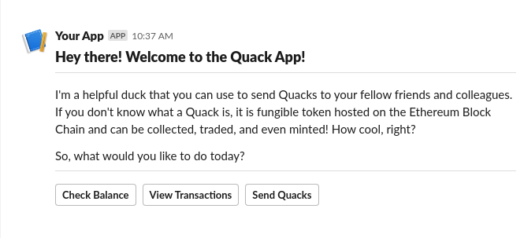
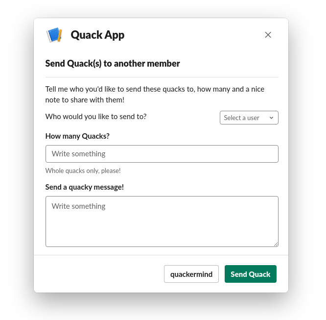
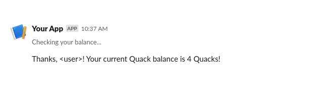
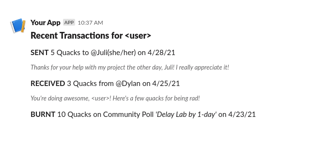

# Quack Slack Wireframe Examples.

Wireframes created in Slack Block-kit Builder.

### Welcome Message:

This is generated using the slash command to trigger the bot (i.e. /quack).

### Send Quacks Modal:

Upon clicking 'Send Quacks' on welcome message, user is prompted with the modal.

### Check Balance Message:

Upon selecting 'Check Balance', user is sent a confirmation message indicating their current Quack balance. Only visible to the user calling this request.

### View Transactions Message:

Upon selecting 'View Transactions', user is sent a message with their recent transactions. Only visible to the user calling this request.

